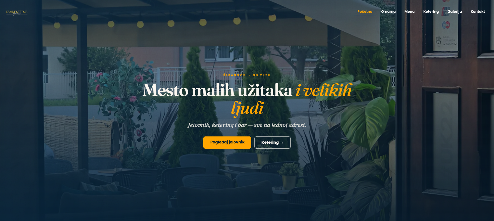

<div align="center">

# 22 Square Bar

### Full-stack restaurant website for a neighborhood bar in Šimanovci, Serbia

Editorial-style React frontend with a JWT-protected admin panel for live menu management.
Replaces a static HTML site that ran for 5 years with a modern, mobile-first stack.

[](https://22squarebar.com)
[](./LICENSE)


</div>

---

<div align="center">



</div>

---

## 🎯 What this project is

A real production site for **22 Square Bar**, a restaurant and bar that opened on
4 March 2020 and has served the industrial zone in Šimanovci ever since.

The previous site was static HTML — fine in 2020, but every menu change meant editing
markup. This rewrite gives the owners a **proper admin panel** so they can update the
menu, prices, and availability themselves in real time.

It's also a portfolio piece showing how I think about full-stack restaurant sites:
**editorial design** that respects the brand, **production-grade hardening** on the
server, and **performance** that survives cellular connections.

---

## ✨ Features

<table>
<tr>
<td width="33%" valign="top">

### 🍽️ Public site

Editorial homepage with founder story, pull quotes, and Google reviews carousel. Live menu with sticky scroll-spy nav across three sections (Jelovnik / Fast food / Karta pića). Catering page with photo gallery and contact CTA. Embedded Google Maps on contact page.

</td>
<td width="33%" valign="top">

### 🔐 Admin panel

JWT-protected `/admin`. Full menu CRUD with category ordering. Toggle item availability with a single click. Toast notifications for every action. Auto-redirect on token expiry. Bcrypt 12 rounds, login throttled to 10 attempts / 15 min.

</td>
<td width="33%" valign="top">

### ⚡ Performance

WebP image pipeline (108 MB → 10 MB). In-memory menu cache, 5 min TTL, invalidated on writes. Code-split routes via `React.lazy`. Compression + skeleton loaders. Mobile-first, reduced-motion friendly.

</td>
</tr>
<tr>
<td valign="top">

### ♿ Accessibility

Semantic landmarks (`<main>`, `<section aria-labelledby>`). Visible focus rings (`:focus-visible`). Descriptive alt text on every image. ARIA labels on all interactive controls. Tap targets ≥ 44px on mobile.

</td>
<td valign="top">

### 🔍 SEO

Per-page meta via React Helmet. Open Graph + Twitter Cards on all routes. Locale-correct currency formatting (`Intl`, sr-RS). Structured headings and skip-friendly nav.

</td>
<td valign="top">

### 🛡️ Security

CSP enabled (Helmet). CORS allowlist (no wildcards). Body size capped. Input validation on all admin endpoints. Env validation at boot. `trust proxy` for accurate IP-based rate limiting behind cPanel.

</td>
</tr>
</table>

---

## 🛠️ Tech stack

<table>
<tr>
<td valign="top">

**Frontend**

- React 18 + Vite 5
- React Router 6
- Tailwind CSS 3 with custom palette
- Fraunces (display) + Poppins (body)
- Framer Motion (page transitions)
- React Hot Toast
- Axios with 401 interceptor

</td>
<td valign="top">

**Backend**

- Node.js 18 + Express 4 (ESM)
- MySQL 8 / MariaDB (`mysql2/promise`)
- JWT + bcrypt (12 rounds)
- Helmet, CORS, express-rate-limit
- Custom validation middleware
- Graceful shutdown on SIGTERM

</td>
<td valign="top">

**Infra**

- cPanel + Phusion Passenger
- Let's Encrypt SSL
- MySQL on same host
- File-based image pipeline (sharp)

</td>
</tr>
</table>

---

## 🎨 Design language

| Token      | Hex       | Used for                                  |
| ---------- | --------- | ----------------------------------------- |
| Navy       | `#092e4a` | Primary text, navbar, footer              |
| Orange     | `#ffa500` | CTAs, accent rules, focus rings           |
| Terracotta | `#c95f3e` | Secondary accent, prices, italic emphasis |
| Cream      | `#faf6ef` | Page background (warm, not clinical)      |
| Cream Deep | `#f3ecdf` | Section dividers (Reviews, Catering)      |

Typography pairs **Fraunces** (variable serif with optical-size axis, used italic for
emphasis) with **Poppins** for body. The serif gives the long founder narrative an
editorial feel that fights against the templated-restaurant-site cliché.

---

## 📁 Project structure

```
.
├── client/                          # React app (Vite)
│   ├── public/
│   │   ├── galerija/                # Home gallery (15 WebP)
│   │   ├── galerijaK/               # Catering gallery (16 WebP)
│   │   ├── slike/                   # Heroes, marketing images
│   │   └── favicons/
│   ├── scripts/
│   │   └── optimize-images.mjs      # One-shot WebP converter (sharp)
│   ├── src/
│   │   ├── api/axios.js             # Axios + 401 auto-redirect
│   │   ├── components/
│   │   │   ├── Hero.jsx             # Reusable hero with grain overlay
│   │   │   ├── MenuItemCard.jsx     # Editorial menu row + dotted leader
│   │   │   ├── PullQuote.jsx
│   │   │   ├── Reviews.jsx          # Google reviews showcase
│   │   │   ├── Stamp.jsx            # Rotated "OD 2020" seal
│   │   │   └── ...
│   │   ├── context/AuthContext.jsx  # JWT, expiry timer, auto-logout
│   │   ├── pages/                   # Home, Menu, Ketering, Kontakt, Admin, Login
│   │   ├── utils/format.js          # Intl currency formatting
│   │   └── index.css                # Tokens + reusable utilities
│   ├── tailwind.config.js
│   └── vite.config.js
│
├── server/                          # Express API
│   ├── controllers/                 # auth, menu
│   ├── db/
│   │   ├── db.js                    # MySQL pool (size 10, 10s timeout)
│   │   ├── seed.js                  # Tables + composite index
│   │   └── set-admin-password.js    # CLI to set/rotate admin password
│   ├── middleware/                  # requireAuth, validate
│   ├── routes/                      # menu, auth, admin
│   ├── utils/env.js                 # Boot-time env validation
│   └── app.js                       # Passenger-compatible entry
│
├── menu_seed.sql                    # Initial menu data (~170 items)
├── category_order_migration.sql     # Adds category_order column
└── README.md
```

---

## 🚀 Getting started

### Prerequisites

- Node.js 18+
- MySQL 5.7+ or MariaDB 10.3+

### 1 — Clone & install

```bash
git clone https://github.com/<your-username>/22-square-bar.git
cd 22-square-bar

cd client && npm install && cd ..
cd server && npm install && cd ..
```

### 2 — Configure environment

```bash
cp client/.env.example client/.env
cp server/.env.example server/.env
```

Generate a strong JWT secret and paste into `server/.env`:

```bash
node -e "console.log(require('crypto').randomBytes(48).toString('hex'))"
```

### 3 — Initialize the database

```bash
cd server
node db/seed.js                                       # tables + indexes
node db/set-admin-password.js 22admin "YourStrongPwd" # admin user
```

Seed the menu by running [menu_seed.sql](./menu_seed.sql) in phpMyAdmin or `mysql` CLI.

### 4 — Run

```bash
# Terminal 1 — backend (port 3000)
cd server && npm run dev

# Terminal 2 — frontend (port 5173)
cd client && npm run dev
```

Visit **http://localhost:5173** for the public site, **/admin/login** for the admin panel.

---

## 📦 Build & deploy

### Build the frontend

```bash
cd client && npm run build
```

Output: `client/dist/` — about 10 MB including all WebP gallery images.

### Deploy to cPanel + Passenger

1. Upload `client/dist/*` → `public_html/`
2. Upload `server/*` (without `node_modules/`) → `~/server/`, then run **NPM install** from cPanel's Node.js App UI
3. Set `STATIC_PATH=/home/<user>/public_html` and update `CORS_ORIGINS` in `server/.env`
4. Restart the Node app
5. Enable Let's Encrypt SSL on the domain

> The same `dist/` works on any domain because `VITE_API_URL=/api` is relative —
> no rebuild needed when the domain changes.

---

## 🔒 Security highlights

| Check             | Implementation                                                |
| ----------------- | ------------------------------------------------------------- |
| Password hashing  | bcrypt, 12 rounds                                             |
| Session           | JWT with 12 h expiry; client decodes `exp` and auto-logs out  |
| Login brute-force | `express-rate-limit`: 10 attempts / 15 min / IP               |
| Body size         | Capped at 10 KB                                               |
| Headers           | Helmet + custom CSP                                           |
| CORS              | Strict allowlist from env (`CORS_ORIGINS`)                    |
| Env safety        | Boot crashes if any required var missing or `JWT_SECRET < 32` |
| Input validation  | Per-field rules on every admin write                          |
| Reverse-proxy IP  | `app.set('trust proxy', 1)` for accurate rate limiting        |
| Graceful shutdown | `SIGTERM`/`SIGINT` close pool + HTTP server                   |

---

## 🖼️ Image optimization

Convert all PNGs/JPEGs in `client/public/` to WebP, resized to max 1600 px wide:

```bash
cd client && node scripts/optimize-images.mjs
```

- Originals moved to `client/_originals_backup/` (gitignored)
- Idempotent — skips files already converted
- Typical reduction: **~90% smaller** payload

---

## 📊 What changed vs the old site

| Aspect        | Old site (static HTML, 2020) | New site (2026)                                      |
| ------------- | ---------------------------- | ---------------------------------------------------- |
| Menu updates  | Edit HTML, redeploy          | Login → edit in browser → instant                    |
| Mobile UX     | Hamburger + scroll           | Sticky scroll-spy nav, mobile-bottom CTA on Catering |
| Performance   | 30+ MB galleries, no caching | 10 MB total, in-memory API cache, lazy routes        |
| Accessibility | None                         | WCAG 2.1 AA-friendly                                 |
| SEO           | Title only                   | Per-page Open Graph + Twitter Cards                  |
| Security      | n/a (no backend)             | Hardened Express + JWT + rate limiting               |
| Tech debt     | Inline JS, table layouts     | Component-based React, design tokens, typed env      |

---

## 📝 License

MIT — see [LICENSE](./LICENSE).

---

<div align="center">

**Built by [Mateja Pavlović](https://www.linkedin.com/in/mateja-pavlovic-85ba35340)**

[LinkedIn](https://www.linkedin.com/in/mateja-pavlovic-85ba35340) · [Instagram](https://www.instagram.com/matejapavlovic/) · [Live site](https://22squarebar.com)

</div>
